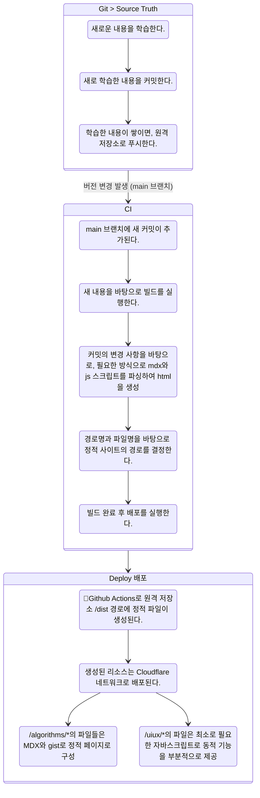

# DEV PLAN 

## Related Docs
- [REVIEW](REVIEW.md)
- [README.md (Root Docs)](../README.md)

---
## v1.0.0 (current)
    This document is written before development:
    이 문서는 개발 전에 작성되었습니다:
### Domain 
https://patterns.leetekwoo.com
### CHALLENGE
**Build Within 6 HOURS** 
<br/>
**6시간 안으로 개발을 완료한다.**
---
### Purpose & Spec 
목적과 요구사항
1. git과 연동된 정적 사이트를 생성한다.
   - 새로운 내용을 학습하고, remote origin push하면 정적 페이지 생성-배포
2. /algorithms/*
    - 알고리즘, 자료 구조 등을 학습한 내용으로 구성한다.
    - 학습 내용은 .mdx로 작성한다.
    - 정해진 스타일 대로 정적 페이지를 렌더링한다.
    - 리스트 페이지 경로는 `/algorithms/{경로}`를 따른다.
      - `/algorithms` 일 시 모든 글
      - `/algorithms/*` 일 시 필터링 된 글
    - 상세 페이지 경로는 `/algorithms/{경로}/{파일 이름.mdx}`를 따른다.
      - `Gist`를 사용해 코드와 MDX의 문서 내용을 함께 기술한다.
4. /uiux/*
   - 컴포넌트를 작성한다.
   - MDX와 컴포넌트로 구성한다.
   - 프레임워크 별로 해당 페이지에 쓰인 컴포넌트와 코드를 함께 기술한다.
   - 리스트 페이지 경로는 `/uiux/{경로}`를 따른다.
     - `/uiux`일 시 모든 글 리스팅
     - `/uiux/*`일 시 필터링 된 글 
   - 상세 페이지 경로는 `/uiux/{경로}/{파일 이름.mdx}`를 따른다.
     - 경로 내부 파일 구성:
       - 컴포넌트 (상호 작용 가능. 다양한 프레임워크 지원.)
       - `Gist` 코드
       - Props 등 컴포넌트와 상호작용 가능한 컨트롤 보드 
         - (Storybook Controls add on과 유사)
       - 문서 부분 (MDX)
5. (TBA) Backend, Infra 등의 내용을 추가
6. Github Actions 빌드 스크립트, Cloudflare Pages와 연동한 CI/CD
    - Data Source Of Truth === git에 저장된 문서 코드
    - pages functions, worker 등 백엔드 코드의 최소화 (가능하면 사용하지 않는다.)

### Project Folder Structure
```  
pattern-recognition  
├── algorithms // listing all pages  
│      └── {graph, tree, hash... etc} // listing pages (filtered)  
│           └── {UNIQUE file_name} // query pathname. 
├── docs // versioning, dev plan, review docs  
└── uiux // monorepo part // listing all pages   
           └── {frameworks/components/domain..etc} // listing pages (filtered)  
                └── {path_name UNIQUE} // detail page                     
                query with searchParam + unique pathname with project-directory               
```  

### Work Flow

**Source Of Truth : Git Files (on remote origin)**

